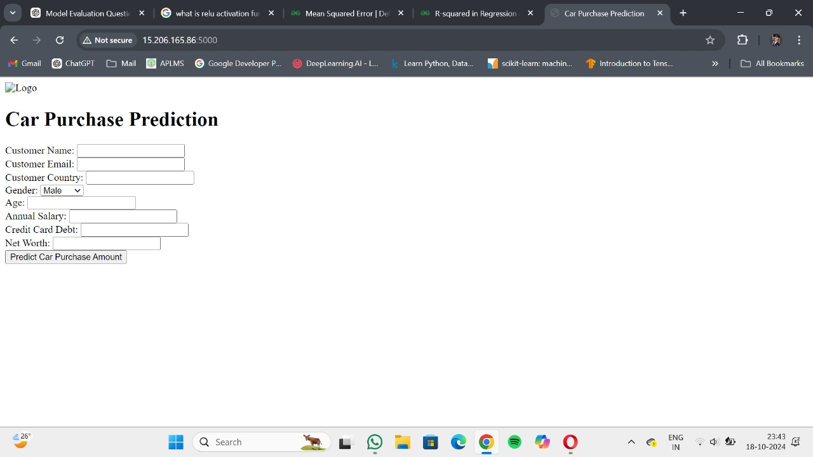
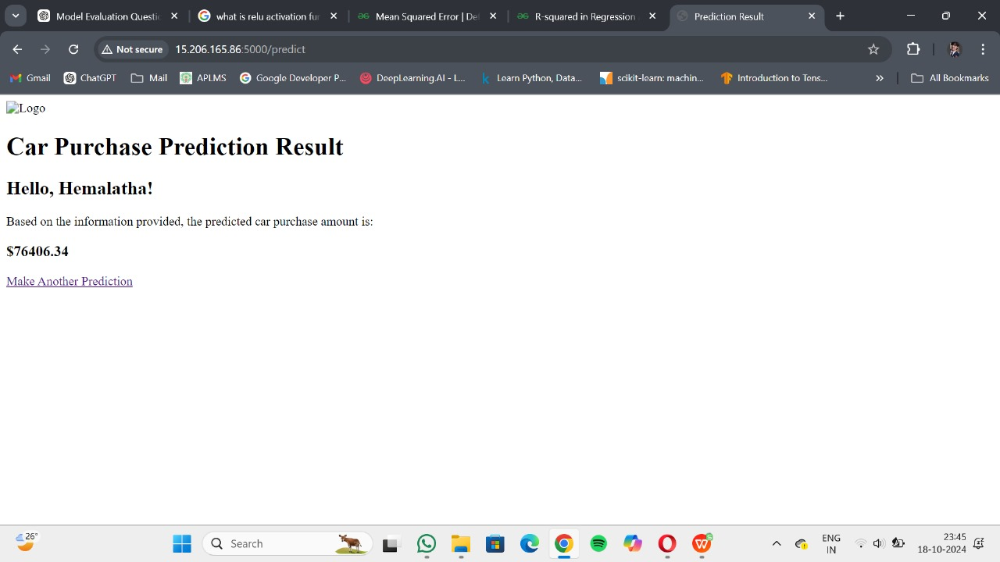

# 🚗 Car Purchase Amount Prediction AI 

**A machine learning-powered web application that predicts the potential purchase amount of a car based on customer data using a Linear Regression model.**

<p>
  
  
  
  
  
</p>

</div>

---

## 🌟 Project Overview & Screenshots

This project tackles the problem of predicting how much a customer is likely to spend on a car. It uses a customer's age, gender, annual salary, and credit card debt to train a Linear Regression model. The final model is deployed as a web application using Flask, containerized with Docker, and hosted on an AWS EC2 instance.

### Web Application Interface
*This is the main page where users can input customer data.*
<div align="center">
  
</div>

### Prediction Results
*After submitting the data, the application shows the predicted purchase amount.*
<div align="center">
  
</div>

---

## ✨ Core Features

* **User-Friendly Web Form:** An intuitive interface for inputting customer details.
* **Real-Time Prediction:** The backend Flask server provides instant predictions using the trained neural network.
* **Deep Learning Model:** A multi-layer feedforward neural network (not a simple linear model) captures non-linear relationships in the data.
* **Containerized & Portable:** The entire application is packaged in a Docker container for easy deployment.
* **Cloud-Ready:** Deployed on an AWS EC2 instance for public accessibility.
* **Data-Driven Model:** The model is trained on a real-world dataset of customer financial data.

---

## 🛠️ Technology Stack

| Category | Technologies |
|---|---|
| **Backend** | Python, Flask |
| **Machine Learning / Deep Learning** | TensorFlow, Keras, Scikit-learn (preprocessing & metrics), Pandas, NumPy |
| **Frontend**| HTML, CSS (as part of the Flask template) |
| **Containerization** | Docker |
| **Cloud Deployment** | AWS EC2 |

---

## 🤖 Neural Network Workflow

The model was developed and trained in the `model.ipynb` Jupyter Notebook.

1. **Data Loading & Exploration:** The `customer_data_linear_regression.csv` dataset was loaded into a Pandas DataFrame, and a Seaborn pairplot was used to visualize relationships between features.
2. **Feature Selection:** Non-predictive columns (`Customer Name`, `Customer e-mail`, `Country`) and the target (`Car Purchase Amount`) were dropped from the input features, leaving `Gender`, `Age`, `Annual Salary`, `Credit Card Debt`, and `Net Worth`.
3. **Preprocessing:** The categorical `Gender` column was label-encoded (`Female` → 1, `Male` → 0). Both the input features (`X`) and the target (`y`) were then scaled to a 0–1 range using `MinMaxScaler`.
4. **Train/Test Split:** The scaled data was split into training and testing sets (75% train / 25% test).
5. **Model Architecture:** A Keras `Sequential` neural network was built with:
   - Input layer accepting 5 features
   - Hidden layer 1: `Dense(25, activation='relu')`
   - Hidden layer 2: `Dense(25, activation='relu')`
   - Output layer: `Dense(1, activation='linear')` for regression
6. **Compilation & Training:** The model was compiled with the **Adam optimizer** and **Mean Squared Error (MSE)** loss, then trained for **50 epochs** with a batch size of 32 and a 20% validation split. Training/validation loss curves were plotted to check for overfitting.
7. **Model Evaluation:** Predictions were inverse-transformed back to their original scale, then evaluated against actual values using **Mean Squared Error** and **R² score**.
8. **Model Serialization:** The trained Keras model was serialized with `pickle` and saved to `model.pkl` for use in the Flask application.

---

## 🚀 Getting Started Locally

### 1. **Clone the Repository**
```bash
git clone https://github.com/hemalatha0303/Car_sales_prediction_deployedInAWS.git
cd Car_sales_prediction_deployedInAWS
```

### 2. **Set Up a Virtual Environment**
```bash
# Create and activate the environment
python -m venv venv
source venv/bin/activate  # On Windows: .\venv\Scripts\activate
```

### 3. **Install Dependencies**
```bash
pip install -r requirements.txt
```

### 4. **Run the Flask App**
```bash
python app.py
```
> 🎉 Your application is now running at **http://127.0.0.1:8501**!

---

## 🐳 Running with Docker

This application is fully containerized. To run it using Docker, follow these steps:

### 1. **Build the Docker Image**
```bash
docker build -t car-prediction-app .
```

### 2. **Run the Docker Container**
```bash
docker run -p 8501:8501 car-prediction-app
```
> The application will be accessible at **http://localhost:8501**.

---

## ☁️ Cloud Deployment on AWS EC2

This application was deployed to the cloud using the following steps:
1. **Launch an EC2 Instance:** An Amazon Linux or Ubuntu instance was provisioned.
2. **Configure Security Group:** The security group was configured to allow incoming traffic on the app's port (8501) and port 22 (SSH).
3. **Install Docker:** Docker was installed on the EC2 instance.
4. **Transfer Files:** The project files (including `app.py`, `Dockerfile`, `model.pkl`, etc.) were securely transferred to the instance.
5. **Build & Run Container:** The Docker image was built and run on the EC2 instance, exposing the application to the internet.
